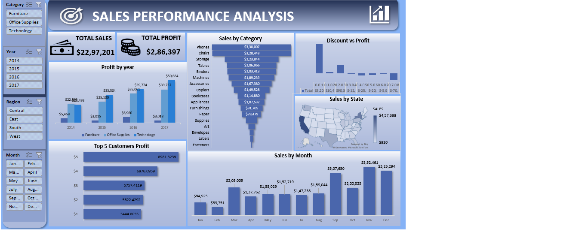

# 📊 Sales Performance Analysis (2014–2017)

## 📖 Project Overview
This project features a comprehensive **Sales Performance Dashboard** built in Microsoft Excel to analyze retail operations and profitability. By processing a dataset of approximately $9,994$ transactions across four years ($2014$–$2017$), this project identifies key revenue drivers, regional performance disparities, and the critical impact of discounting on the bottom line.

The dashboard serves as a strategic tool for stakeholders to visualize complex data and transition from simple volume-based reporting to value-driven decision-making.

---
## 🖼️ Dashboard Preview

## 🚀 Key Business Insights

### 1. Technology: The Primary Growth Engine
* **Insight:** **Technology** is the primary revenue and profit driver for the business. It generates the highest sales while maintaining superior profit margins.
* **Analysis:** This category demonstrates healthy market demand and effective pricing strategies, making it the most resilient segment of the business.

### 2. The Furniture Profitability Crisis
* **Insight:** **Furniture** shows a critical profitability issue. Despite producing high sales volume, it yields extremely low profit.
* **Risk Factor:** This suggests that aggressive discounting combined with high operational and shipping costs makes Furniture a major risk to the overall business performance.

### 3. Regional Excellence (The "West" Benchmark)
* **Insight:** The **West Region** is the strongest-performing market, delivering the highest profit with balanced sales growth. 
* **Strategic Value:** The West serves as the operational benchmark. Its pricing and discount management strategies should be treated as the "Gold Standard" for other regions.

### 4. Promotion-Driven Sales vs. Margin Erosion
* **Insight:** Sales growth is positive but heavily promotion-driven, with significant spikes during specific seasonal periods. 
* **Caution:** Higher sales volume during these periods does not always correlate with higher profit, highlighting a persistent risk of **margin erosion** where the cost of the discount outweighs the benefit of the volume.

### 5. The Correlation of Discounting to Loss
* **Insight:** Discounting has a direct and measurable negative impact on profitability, especially beyond moderate levels ($0.2+$). 
* **Finding:** High discounts frequently result in reduced or negative profit margins, a trend particularly prevalent in the **Furniture** category and specific regional segments.

### 6. Regional Inefficiencies (Central & South)
* **Insight:** The **Central and South** regions underperform in profitability despite contributing significantly to total sales volume.
* **Implication:** This indicates localized inefficiencies in the product mix, pricing structures, or logistics that require immediate strategic intervention.

---

## 🛠️ Technical Implementation
* **Data Transformation:** Utilized **Power Query** to clean and shape $\sim 10,000$ rows of raw transactional data.
* **Analytical Modeling:** Built complex **Pivot Tables** to aggregate data across categories, regions, and time dimensions.
* **Advanced Logic:** Applied Excel formulas (e.g., `SUMIFS`, `VLOOKUP`, `INDEX/MATCH`) to calculate dynamic KPIs such as **Profit Margin** and **Delivery Time**.
* **Data Visualization:** Designed an interactive interface using **Slicers, Timelines, and Pivot Charts** to allow stakeholders to perform self-service analysis.

---

## 💡 Strategic Recommendations
1. **Optimize Furniture Margins:** Implement a "Discount Cap" on Furniture items and conduct a logistics audit to reduce category-specific shipping costs.
2. **Apply Regional Benchmarking:** Scale the pricing and discount logic from the **West Region** to the Central and South regions to recover lost profit.
3. **Profit-First Promotions:** Shift Q4 marketing strategy from "Volume Growth" to "Profitable Growth" to avoid the common trap of margin erosion during peak sales months.
4. **Inventory Prioritization:** Direct more inventory and marketing spend toward **Technology** and sub-categories like **Phones** and **Chairs**, which represent over $\$650,000$ in combined revenue.

---

## 📧 Contact
If you have any questions regarding the methodology or would like to discuss the insights further, please feel free to reach out.

**Author:** FABIHA KIRAN   

